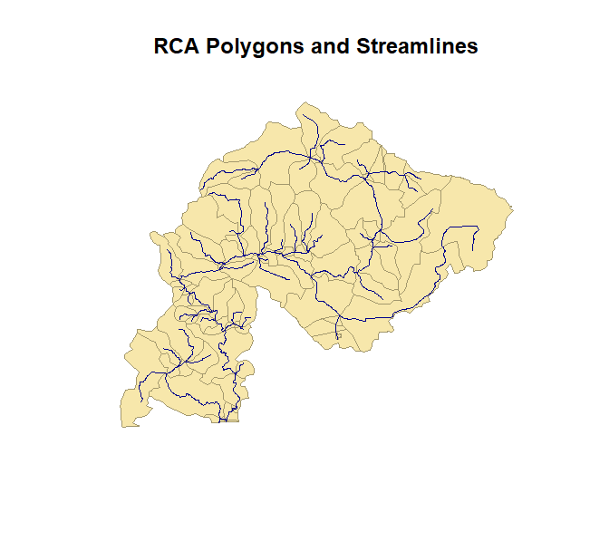
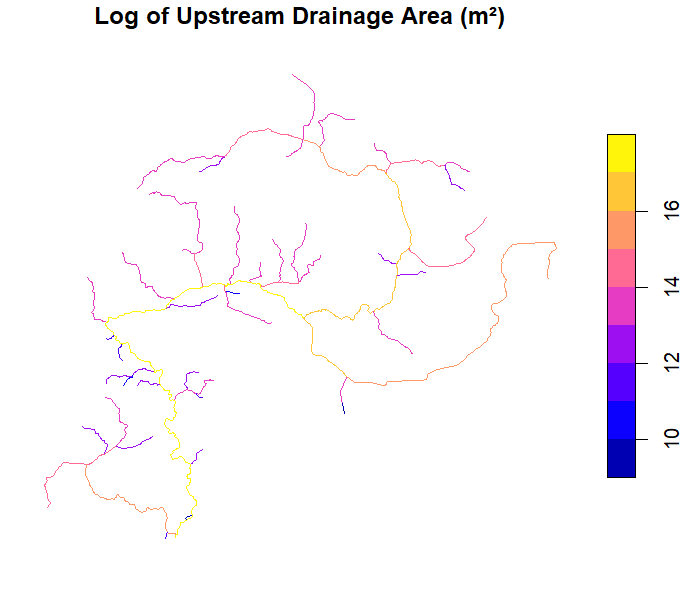
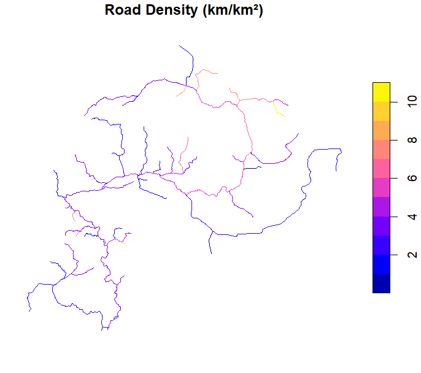

# SSNenvSummary
Upstream and downstream stream network environmental summaries for SSN objects

## Installation

The easiest way to install the `SSNenvSummary` package is from within the [RStudio IDE](https://www.rstudio.com/products/rstudio/download/) using `remotes::install_github()`. At this time the package has not been published to CRAN so the default `install.packages()` will not work. Instead use remotes (or devtools) to install the package directly from GitHub:
``` r
# You may need to install remotes
library(remotes)
remotes::install_github("mattjbayly/SSNenvSummary")
```

## Basic Workflow

The `summarize_upstream()` function calculates upstream accumulation values for each stream reach in your network. Here's a complete workflow using the included Bertrand Creek sample data.

### Required Inputs

1. **Stream network** (`sf` object): Your stream reaches with unique `rid` identifiers
2. **RCA polygons** (`sf` object): Reach Contributing Area polygons with unique `rca_id` identifiers
3. **Network index** (`data.frame`): A lookup table mapping each `rid` to all upstream `rca_id` values (use `relationships_to_index()` to generate this if starting from an existing SSN)
4. **Environmental data** (`sf` or `data.frame`): Data to summarize, must include `rca_id` column

### Step 1: Load Data

```r
library(SSNenvSummary)
library(sf)

# Load stream network
strm <- st_read(system.file("extdata/Bertrand_Creek/strm.gpkg",
                            package = "SSNenvSummary"))

# Load RCA polygons
rca_polygons <- st_read(system.file("extdata/Bertrand_Creek/rca.gpkg",
                                    package = "SSNenvSummary"))

# Load upstream network index (maps each rid to all upstream rca_ids)
poly_stream_network_us_index <- read.csv(
  system.file("extdata/Bertrand_Creek/poly_stream_network_us_index.csv",
              package = "SSNenvSummary"))

head(poly_stream_network_us_index)
#         rid rca_id
# 1 701653673   4974
# 2 701654000   4974
# 3 701654558   4974
# 4 701654658   4974
# 5 701653088   4974
# 6 701656058   4974

```




### Step 2: Determine UTM Zone

Area and length calculations require a projected coordinate system. Use `getUTMzone()` to automatically determine the appropriate UTM zone:

```r
utm_zone <- getUTMzone(rca_polygons, epsg_code = TRUE)
# 32610 # Returns EPSG code for UTM zone 10N
```

### Step 3: Calculate Upstream Summaries

#### Example 1: Total Upstream Drainage Area

Calculate the total drainage area upstream of each stream reach:

```r

# Check out the documentation
?summarize_upstream 

us_drainage <- summarize_upstream(
  net = poly_stream_network_us_index,
  summary_type = "total_upstream_area",
  rca_polygons = rca_polygons,
  rca_env_data = rca_polygons,
  utm_zone = utm_zone,
  output_fieldname = "drainage_area_m2"
)

# Join results back to stream network
strm <- merge(strm, us_drainage, by = "rid", all.x = TRUE)

# Visualize (log scale for better display)
strm$log_da <- log(strm$drainage_area_m2 + 1)
plot(strm["log_da"])
```




#### Example 2: Linear Density (Road Density)

Calculate upstream road density (km of road per km² of drainage area):

```r
# Load roads layer (must have rca_id from spatial intersection)
roads <- st_read(system.file("extdata/Bertrand_Creek/env/roads.gpkg",
                             package = "SSNenvSummary"))

us_roads <- summarize_upstream(
  net = poly_stream_network_us_index,
  summary_type = "linear_density",
  rca_polygons = rca_polygons,
  rca_env_data = roads,
  utm_zone = utm_zone,
  output_fieldname = "road_density_km_km2"
)

strm <- merge(strm, us_roads, by = "rid", all.x = TRUE)
plot(strm["road_density_km_km2"])
```



## Summary Types

The `summarize_upstream()` function supports the following summary types:

| Summary Type | Description | Use Case |
|-------------|-------------|----------|
| `total_upstream_area` | Sum of upstream RCA polygon areas (m²) | Total drainage area |
| `percent_coverage` | Area of environmental layer / total basin area | Land cover (% forest, % agriculture) |
| `linear_density` | Length of linear features / basin area (km/km²) | Road density, stream density |
| `feature_count` | Count of features / basin area (count/m²) | Stream crossings, water licenses |
| `area_weighted_mean` | Area-weighted average of continuous variable | Mean elevation, mean temperature |
| `min_rca` | Minimum value across upstream RCAs | Minimum elevation |
| `max_rca` | Maximum value across upstream RCAs | Maximum elevation |

## Preparing Environmental Data

Environmental data must include an `rca_id` column linking each feature to its corresponding RCA polygon. This is typically done by performing a spatial intersection in GIS:

```r
# Example: intersect land cover polygons with RCA polygons
landcover_by_rca <- st_intersection(landcover, rca_polygons)
```

For the `area_weighted_mean` summary type, specify the field to average using the `summary_field` parameter:

```r
us_elevation <- summarize_upstream(
  net = poly_stream_network_us_index,
  summary_type = "area_weighted_mean",
  summary_field = "elevation",
  rca_polygons = rca_polygons,
  rca_env_data = elevation_by_rca,
  utm_zone = utm_zone,
  output_fieldname = "mean_upstream_elev"
)
```

## Building the Network Index

If you don't have a pre-built network index, use `relationships_to_index()` to create one from edge relationships:

```r
# edges_df should have 'from' and 'to' columns representing directed connections
network_index <- relationships_to_index(edges_df)
```
